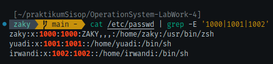
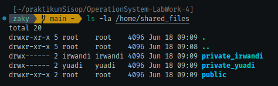
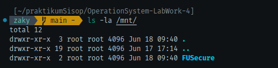
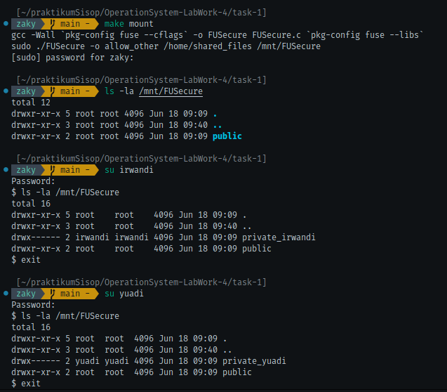

[](https://classroom.github.com/a/V7fOtAk7)
|    NRP     |      Name      |
| :--------: | :------------: |
| 5025241134 | Gilbran Mahdavikia Raja    |
| 5025241148 | Muhammad Zaky Zein         |
| 5025241171 | Muhammad Sholihuddin Rizky |

# Praktikum Modul 4 _(Module 4 Lab Work)_

</div>

### Daftar Soal _(Task List)_

- [Task 1 - FUSecure](/task-1/)

- [Task 2 - LawakFS++](/task-2/)

- [Task 3 - Drama Troll](/task-3/)

- [Task 4 - LilHabOS](/task-4/)

### Laporan Resmi Praktikum Modul 4 _(Module 4 Lab Work Report)_

Tulis laporan resmi di sini!

_Write your lab work report here!_
### task-1 FUSecure
**Answer:**

- **Code & explanation:**

**a. Setup Direktori dan Pembuatan User**
Langkah pertama dalam rencana Yuadi adalah mempersiapkan infrastruktur dasar sistem keamanannya.
1. Buat sebuah "source directory" di sistem Anda (contoh: `/home/shared_files`). Ini akan menjadi tempat penyimpanan utama semua file.
2. Di dalam source directory ini, buat 3 subdirektori: `public`, `private_yuadi`, `private_irwandi`. Buat 2 Linux users: `yuadi` dan `irwandi`. Anda dapat memilih password mereka.

   | User    | Private Folder   |
   | ------- | ---------------  |
   | yuadi   | private_yuadi    |
   | irwandi | private_irwandi  |

Yuadi dengan bijak merancang struktur ini:
folder `public` untuk berbagi materi kuliah dan referensi yang boleh diakses siapa saja, sementara setiap orang memiliki folder private untuk menyimpan jawaban praktikum mereka masing-masing.

```bash
sudo mkdir -p /home/shared_files{public,private_yuadi,private_irwandi}
```
> kode di atas akan membuat source directory beserta subdirectory-nya.

```bash
sudo adduser yuadi
sudo passwd yuadi
```
```bash
sudo adduser irwandi
sudo passwd irwandi
```
> kode di atas digunakan untuk menambah user yang bernama yuadi dan irwandi, passwd untuk membuat password untuk masing-masing user.


```bash
cd /home/shared_files
sudo chown yuadi:yuadi private_yuadi
sudo chmod 700 private_yuadi
```
```bash
sudo chown irwandi:irwandi private_irwandi
sudo chmod 700 private_irwandi
```
> agar foldernya hanya dapat diakses oleh user tertentu, ubah akses dan kepemilikan dari masing-masing private folder.

<br>

**b. Akses Mount Point**

Selanjutnya, Yuadi ingin memastikan sistem filenya mudah diakses namun tetap terkontrol.

FUSE mount point Anda (contoh: `/mnt/secure_fs`) harus menampilkan konten dari `source directory` secara langsung. Jadi, jika Anda menjalankan `ls /mnt/secure_fs`, Anda akan melihat `public/`, `private_yuadi/`, dan `private_irwandi/`.

```bash
sudo mkdir -p /mnt/secure_fs
```
> buat folder untuk mounting point

```c
// global variable
static const char *source_dir = NULL;

int main(int argc, char *argv[]) {
    source_dir = realpath(argv[argc - 2], NULL);
    if (!source_dir) {
        perror("Invalid source_dir");
        exit(1);
    }

    argv[argc - 2] = argv[argc - 1];
    argc--;

    return fuse_main(argc, argv, &scr_oper, NULL);
}
```
> input saat menjalankan program adalah
`sudo ./$(TARGET) -o allow_other $(SRC_DIR) $(MOUNT_DIR)`
yang mana akan memiliki 4 argumen, 2 argumen pertama adalah argumen milik FUSE, sedangkan 2 argumen selanjutnya untuk mendapatkan source directory dan juga mounting pointnya.
variable source_dir akan meyimpan path absolut dari directory source dengan menggunakan fungsi
`realpath(argv[argc - 2], NULL);`
`if (!source_dir)` untuk memastikan apakah source directory adalah directory yang valid, jika tidak keluarkan error message.
`argv[argc - 2] = argv[argc - 1];`
`argc--;`
argv[argc-2] mengarah pada alamat argumen kedua, yaitu source directory, nilainya akan diassign dengan argumen terakhir, yang tidak lain adalah mounting pointnya (menimpanya dengan argumen terakhir). setelah itu argumen countnya akan dikurangi. Hal ini harus dilakukan karena
`fuse_main(argc, argv, &scr_oper, NULL);`
fungsi pada fuse_main tidak membutuhkan parameter source directorynya.

<br>

**c. Read-Only untuk Semua User**

Yuadi sangat kesal dengan kebiasaan Irwandi yang suka mengubah atau bahkan menghapus file jawaban setelah menyalinnya untuk menghilangkan jejak plagiat. Untuk mencegah hal ini, dia memutuskan untuk membuat seluruh sistem menjadi read-only.

1. Jadikan seluruh FUSE mount point **read-only untuk semua user**.
2. Ini berarti tidak ada user (termasuk `root`) yang dapat membuat, memodifikasi, atau menghapus file atau folder apapun di dalam `/mnt/secure_fs`. Command seperti `mkdir`, `rmdir`, `touch`, `rm`, `cp`, `mv` harus gagal semua.

"Sekarang Irwandi tidak bisa lagi menghapus jejak plagiatnya atau mengubah file jawabanku," pikir Yuadi puas.

> karena soal meminta hanya akses read only saja, maka buat struct fusenya hanya dengan fungsi-fungsi yang dibutuhkan untuk read saja.

```c
static struct fuse_operations scr_oper = {
    .getattr = scr_getattr,
    .readdir = scr_readdir,
    .open    = scr_open,
    .read    = scr_read,    
};
```

<br>

**d. Akses Public Folder**

Meski ingin melindungi jawaban praktikumnya, Yuadi tetap ingin berbagi materi kuliah dan referensi dengan Irwandi dan teman-teman lainnya.

Setiap user (termasuk `yuadi`, `irwandi`, atau lainnya) harus dapat **membaca** konten dari file apapun di dalam folder `public`. Misalnya, `cat /mnt/secure_fs/public/materi_kuliah.txt` harus berfungsi untuk `yuadi` dan `irwandi`.

<br>

**e. Akses Private Folder yang Terbatas**

Inilah bagian paling penting dari rencana Yuadi - memastikan jawaban praktikum benar-benar terlindungi dari plagiat.

1. File di dalam `private_yuadi` **hanya dapat dibaca oleh user `yuadi`**. Jika `irwandi` mencoba membaca file jawaban praktikum di `private_yuadi`, harus gagal (contoh: permission denied).
2. Demikian pula, file di dalam `private_irwandi` **hanya dapat dibaca oleh user `irwandi`**. Jika `yuadi` mencoba membaca file di `private_irwandi`, harus gagal.

"Akhirnya," senyum Yuadi, "Irwandi tidak bisa lagi menyalin jawaban praktikumku, tapi dia tetap bisa mengakses materi kuliah yang memang kubuat untuk dibagi."

untuk soal d dan e:
```c
static const char *users[] = {"yuadi", "irwandi"};
static const char *users_dir[] = {"private_yuadi", "private_irwandi"};
static const int usrcnt = 2;
```

```c
int check_access(const char *path) {
    struct fuse_context *context = fuse_get_context();
    struct passwd *pw = getpwuid(context->uid);
    const char *username = pw ? pw->pw_name : "";

    if (strstr(path, "public") != NULL) return 0;

    for (int i = 0; i < usrcnt; i++) if (strstr(path, users_dir[i]) != NULL && strcmp(username, users[i]) != 0) return -EACCES;
    
    return 0;
}
```
> `struct fuse_context *context = fuse_get_context();` pointer context akan menyimpan context pada FUSE, seperti UID, GID, dan PID.
`struct passwd *pw = getpwuid(context->uid);` Fungsi getpwuid() mengambil informasi user (nama, home dir, shell, dll) berdasarkan UID dari context FUSE tadi.
`const char *username = pw ? pw->pw_name : "";` menyimpan username jika pw tidak NULL, jika NULL inisialisasikan dengan string kosong.
`if (strstr(path, "public") != NULL) return 0;`
jika pathnya ada kata/substring public, maka kembalikan nilai 0 (bisa diakses siapa saja).
`for (int i = 0; i < usrcnt; i++) if (strstr(path, users_dir[i]) != NULL && strcmp(username, users[i]) != 0) return -EACCES;`
menelusuri path-path yang mengandung nama 'private_yuadi' dan 'private_irwandi' jika sesuai dengan nama dan usernamenya tidak sesuai, maka kembalikan -EACCESS (tolak akses).
`return 0;` jika tidak sesuai dengan public ataupun folder-folder private tadi, maka kembalikan nilai 0 (folder lain juga dapat diakses oleh siapa saja).

<br>

implementasi dari fungsi-fungsi FUSE untuk read-only


```c
static void fullpath(char fpath[PATH_MAX], const char *path) {
    snprintf(fpath, PATH_MAX, "%s%s", source_dir, path);
}

static int scr_getattr(const char *path, struct stat *statbuf) {
    char fpath[PATH_MAX];
    fullpath(fpath, path);
    
    if (check_access(path) != 0) return -EACCES;
    
    if (lstat(fpath, statbuf) == -1) return -errno;
    
    return 0;
}

static int scr_readdir(const char *path, void *buf, fuse_fill_dir_t filler, off_t offset, struct fuse_file_info *fi) {
    char fpath[PATH_MAX];
    fullpath(fpath, path);
    
    DIR *dp = opendir(fpath);
    if (dp == NULL) return -errno;
    
    struct fuse_context *context = fuse_get_context();
    struct passwd *pw = getpwuid(context->uid);
    const char *username = pw ? pw->pw_name : "";
    
    struct dirent *de;
    filler(buf, ".", NULL, 0);
    filler(buf, "..", NULL, 0);
    
    while ((de = readdir(dp)) != NULL) {
        const char *name = de->d_name;
        int has_access = 0;
        
        if (strcmp(name, "public") == 0) {
            has_access = 1;
        } else {
            for (int i = 0; i < usrcnt; i++) {
                if (strcmp(name, users_dir[i]) == 0 && strcmp(username, users[i]) == 0) {
                    has_access = 1;
                    break;
                }
            }
        }
        if (has_access) filler(buf, name, NULL, 0);
    }

    closedir(dp);
    return 0;
}

static int scr_open(const char *path, struct fuse_file_info *fi) {
    char fpath[PATH_MAX];
    fullpath(fpath, path);

    if (check_access(path) != 0) return -EACCES;

    if ((fi->flags & O_WRONLY) || (fi->flags & O_RDWR)) return -EACCES;

    int fd = open(fpath, fi->flags);
    if (fd == -1) return -errno;

    close(fd);
    return 0;
}

static int scr_read(const char *path, char *buf, size_t size, off_t offset, struct fuse_file_info *fi) {
    char fpath[PATH_MAX];
    fullpath(fpath, path);

    if (check_access(path) != 0) return -EACCES;

    int fd = open(fpath, O_RDONLY);
    if (fd == -1) return -errno;

    int res = pread(fd, buf, size, offset);
    if (res == -1) res = -errno;

    close(fd);
    return res;
}
```

> `static void fullpath(char fpath[PATH_MAX], const char *path)`
Fungsi ini membuat path absolut fpath dari source_dir dan path relatif dari FUSE.
Contoh: source_dir = /home/shared_files dan path = /public/file.txt, maka fpath akan menjadi /home/shared_files/public/file.txt.
`static int scr_getattr(const char *path, struct stat *statbuf)`
jika akses ke path ditolak, maka kembalikan -EACCESS. jika bisa akes, maka fungsi ini akan mendapatkan atribut dari path tersebut dengan `lstat(fpath, statbuf)` yang artinya atribut dari path tersebut akan disimpan pada stat buffer yang bernama statbuf. jika pengambilan tidak berhasil, maka return kode error.
`static int scr_readdir(const char *path, void *buf, fuse_fill_dir_t filler, off_t offset, struct fuse_file_info *fi)`
secara singkan fungsi di atas akan menangani command `ls`. awalnya buka directory dengan `opendir()` lalu dapatkan context. setelah itu lakukan iterasi ke folder-folder dalam directory yang dibuka. jika memiliki akses tambahkan ke buffer dengan `filler()`.
`static int scr_open(const char *path, struct fuse_file_info *fi)`
`static int scr_read(const char *path, char *buf, size_t size, off_t offset, struct fuse_file_info *fi)`
kedua fungsi di atas masing-masing berguna untuk menangani pembukaan file dan dan pembacaan file.

- **Screenshots :**

a.
<div align="center">
    
</div>

<div align="center">
    
</div>

b.
<div align="center">
    
</div>

result:
<div align="center">
    
</div>